<p align='center'>
  
</p>

# YourCity
YourCity is a city matching App that matches users to their ideal city. It is a fullstack React App made with a Redux state manager and a backend using Python, Flask, SQL-Alchemy, and PostgresSQL. 

* View the <a href='https://yourcity-app.herokuapp.com/'>YourCity</a> App Live

* Reference to the YourCity <a href='https://www.github.com/nicopierson/yourcity/wiki'>Wiki Docs</a>

| Table of Contents |
| ----------------- |
| 1. [Features](#features) |
| 2. [Installation](#installation) |
| 3. [Technical Implementation Details](#technical-implementation-details) |
| 4. [Future Features](#future-features) |
| 5. [Contact](#contact) |
| 6. [Special Thanks](#special-thanks) |


## Technologies
* <a href="https://developer.mozilla.org/en-US/docs/Web/JavaScript"></a>
* <a href="https://www.postgresql.org/"></a>
* <a href="https://nodejs.org/"></a>
* <a href="https://reactjs.org/"></a>
* <a href="https://redux.js.org/"></a>
* <a href="https://developer.mozilla.org/en-US/docs/Web/CSS"></a>
* <a href="https://www.python.org/"></a>
* <a href="https://flask.palletsprojects.com/"></a>
* <a href="https://www.heroku.com/home"></a>


## Features

### Sign Up and Login Pages
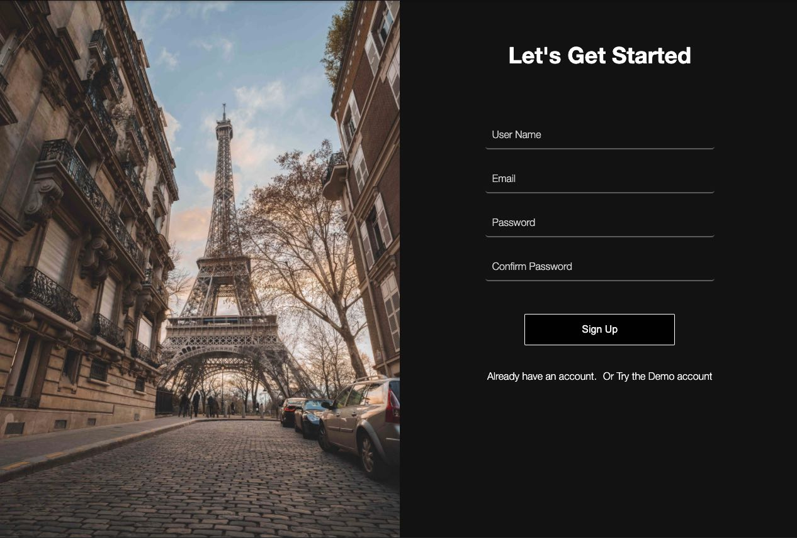
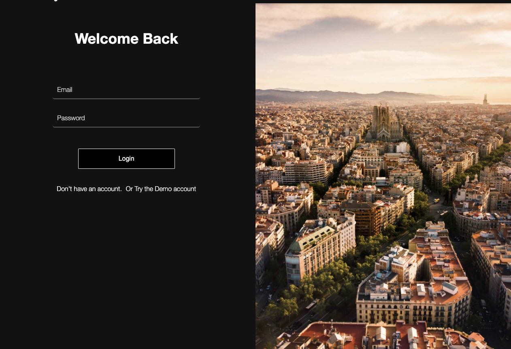

### Splash Page
Discover and search for new cities
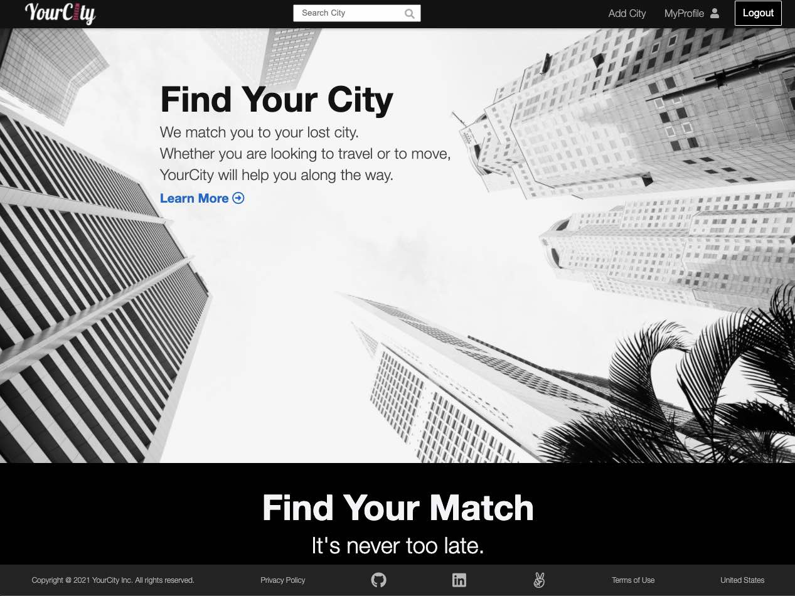

Features
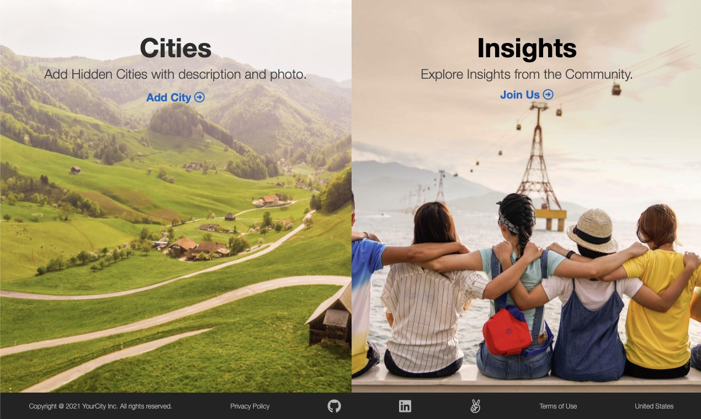

## Profile
Profile card about user and view cities
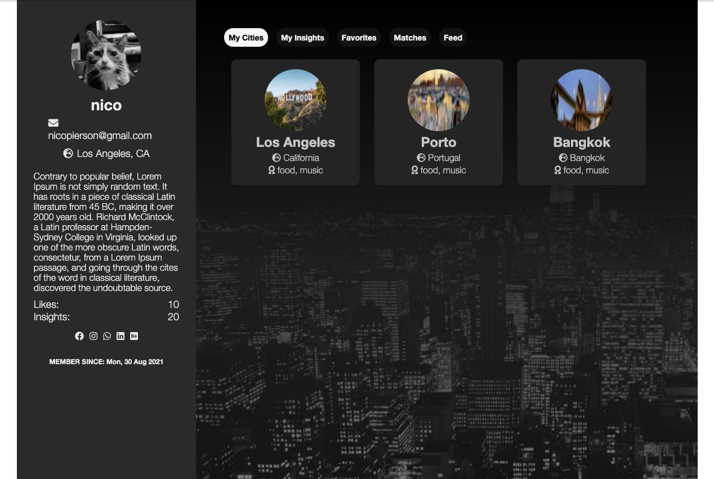

## Feed Tab
YourCity feed displays all cities
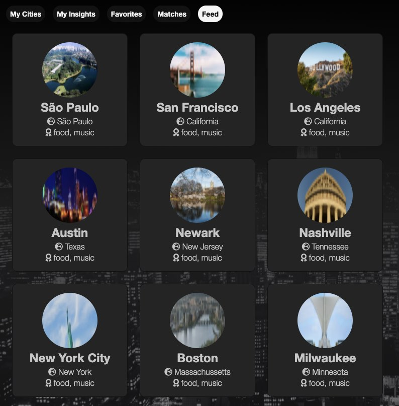

### View, Add, Edit, and Delete Cities
Single city of name, photos, insights
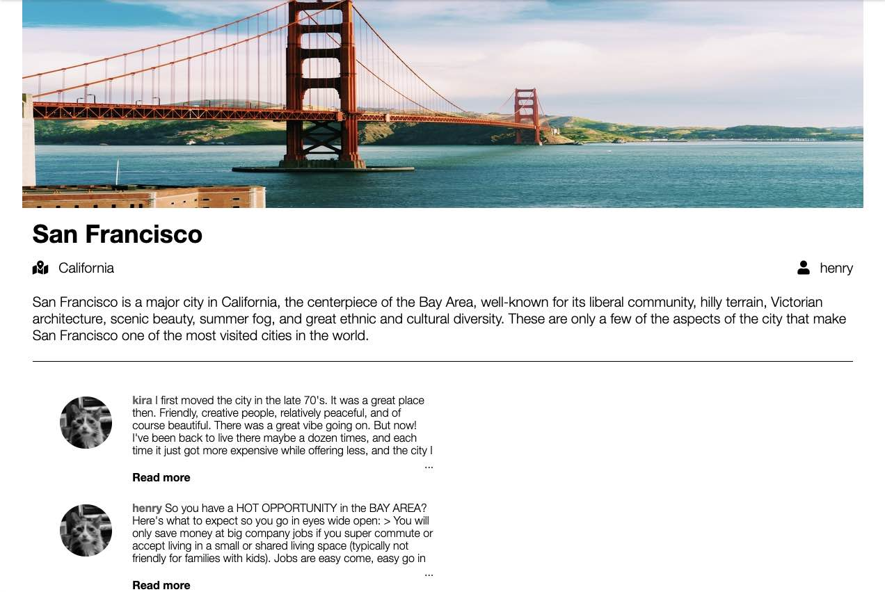

#### Add a City
<p align='center'>
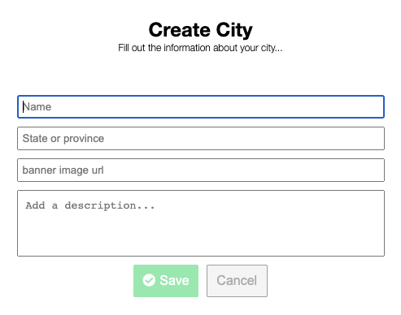
</p>

#### Cancel adding city
<p align='center'>
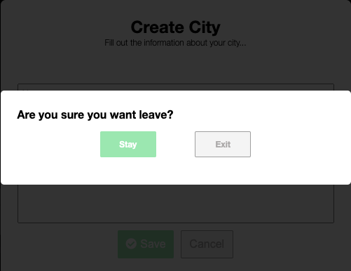
</p>

#### Edit a city
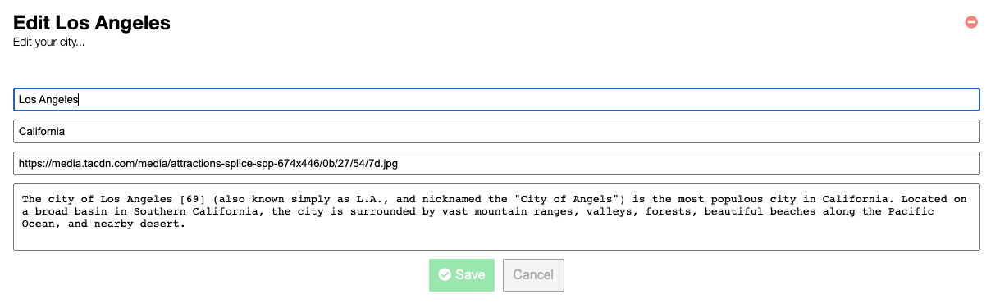

### Create, Read, Update, Delete City Insights

#### View Insights
<p align='center'>
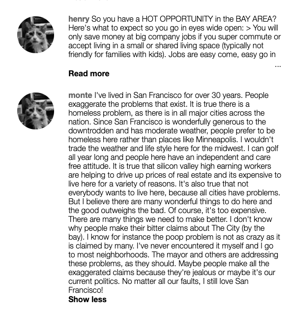
</p>

#### Add Insights
<p align='center'>
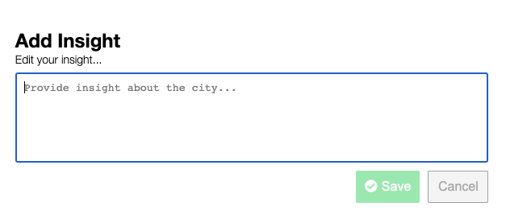
</p>

#### Edit Insights
<p align='center'>
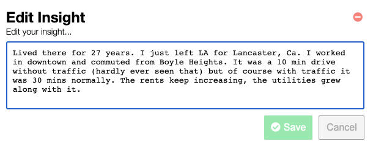
</p>


## Installation
To build/run project locally, please follow these steps:

1. Clone this repository

```shell
git clone https://github.com/{github-handle}/{app-name}.git
```

2. Install Pipfile dependencies and create the virtual environment
```shell
pipenv install
```

2. Install npm dependencies for the `/react-app`

```shell
cd react-app
npm install
```

3. In the `/` root directory, create a `.env` based on the `.env.example` with proper settings

4. Setup your PostgreSQL user, password and database and ensure it matches your `.env` file

5. Before running any flask commands, confirm you are in the pipenv virtual env. If not, run the command:
```shell
pipenv shell
```

5. In the root folder, create the database by running in the terminal:
```shell
flask db create
```

6. In the root folder, migrate tables to the database by running in the terminal:
```shell
flask db migrate
```

7. In the root folder, seed the database by running in the terminal:
```shell
flask seed all
```

8. Start the flask backend in the `/` root directory
```shell
flask run
```

9. Start the frontend in the `/react-app` directory

```javascript
npm start
```


## Technical Implementation Details

### Detail 1
Description 1

Part of code is shown below:

```python
print('add code snippet 1 here')
```

Description 2

```javascript
print('add code snippet 2 here')
```

### Detail 2
Description 1

Code snippet is shown here:

```javascript
print('add code snippet 1 here')
```


## Future Features

1. __Search__ - search cities

2. __Edit Profile__ - users edit profile info and add banner


## Contact

### Nico Pierson
<a href="https://www.linkedin.com/in/nico-pierson/"></a>
<a href="https://angel.co/u/nico-gerard-pierson"></a>
<a href="https://github.com/nicopierson"></a>

nicogpt@gmail.com


## Special Thanks
* Fellow peers who have given me support and community: [Andrew](https://github.com/andru17urdna), [Henry](https://github.com/hnrywltn), [Pierre](https://github.com/TheGuilbotine), [Lema](https://github.com/lemlooma), [Meagan](https://github.com/meagan13), [Simon](https://github.com/Simonvargas), [Michelle](https://github.com/michellekontoff), and [John](https://github.com/Jomix-13)
* Mentors who have given me their time and effort: [Zach](https://github.com/zdwatts), [Olivia](https://github.com/OByrnes), [Ed](https://github.com/edherm), and [Javier](https://github.com/javiermortiz) 
* My partner: [Thayse](https://www.linkedin.com/in/thayse-alencar-946703196/)
